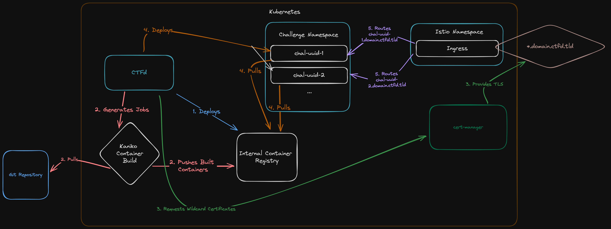

# Architecture

Below is a high-level overview of what this plugin does:

## Steps

1. The plugin deploys an internal Container registry using the docker registry:2 image
    - This serves to hold challenge container images for the cluster 
2. The plugin creates jobs for each challenge of one of the plugin types and takes in a Git repository that containers a Dockerfile specifying how to build the challenge; these jobs then push the built container to the internal challenge registry.
3. The plugin requests wildcard certificates for the domains specified.
4. When a user spawns a challenge instance, CTFd will then deploy a challenge instance, pulling the image from the internal container registry, and telling Istio how to route based on SNI to the challenge instance (or specifying an external TCP port).
5. Istio will route requests to each challenge instance.

## Challenge Lifetimes

The idea is that a user can only have one interactive challenge spawned at a time.  They can kill their current instance at any time, or eventually it'll automatically get killed and cleaned up.

The way this works is that the CTFd frontend shows a spawn instance button on the frontend; once spawned, it shows a countdown as well as a button to extend the time once half the time has expired and a kill button.  

When a challenge is solved, the challenge instance is killed.

Challenge cleanup happens every minute via the `/api/v1/k8s/clean` route.  This is ratelimited, but no auth is needed as all it does is find challenges that have expired and deletes them.

## Emergency

There is a dashboard in the admin UI of CTFd that lets you view challenge instances and manually kill them.  You can also press a kill all button that will kill every challenge instance in case things go bad.

This is simply an auth'd POST request to the `/api/v1/k8s/delete_all` endpoint.  Only administrator users can perform this action.

## Other Endpoints

Extends challenge time given by challenge_id: `/api/v1/k8s/extend` 

Deletes a challenge given by challenge_id and user_id (if admin): `/api/v1/k8s/delete`

Get info about a challenge instance: `/api/v1/k8s/get`

Create a challenge instance: `/api/v1/k8s/create`

